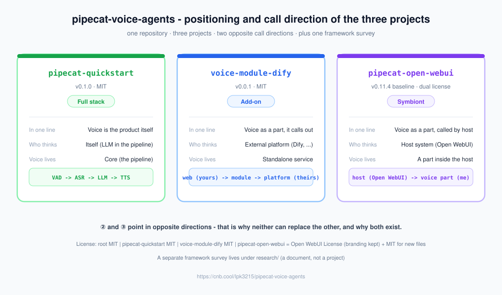

# Pipecat 语音 Agent —— 仓库总览

[English](README.md)

   

> **与 Pipecat 官方无隶属关系。** Pipecat 是 **Daily / pipecat-ai** 的开源框架（BSD-2-Clause）。
> 本仓库是对该框架的**独立学习与实践**，与 Pipecat 项目无从属、赞助或背书关系。

> **先看这一页。** 这个仓库里有**三个项目** + **一份框架调研**，它们回答的是**三个不同的问题**。

---

## 三个项目 · 速览

### 我想要哪个？

| 我想要…… | 去哪 | 一句话 |
|---|---|---|
| 一个**能跑的语音 Agent**（听 → 想 → 说全在自己手里） | 📗 [`pipecat-quickstart/`](pipecat-quickstart/) | **语音就是产品本身** |
| 把语音**插进一个现成的 agent 系统**（宿主是主人） | 📙 [`pipecat-open-webui/`](pipecat-open-webui/) | **被**现成系统调用 |
| 把语音做成**可接入的模块**（模块是主人，去调外部平台） | 📘 [`voice-module-dify/`](voice-module-dify/) | **主动去调**外部平台 |

> 最近在更新的是 📙 `pipecat-open-webui/`。
> 另外两份材料：📄 [`research/pipecat-项目调研.md`](research/pipecat-项目调研.md)（**这框架是什么**，上手前读）·
> 📕 [`pipecat-quickstart/reference/pipecat-modelscope/`](pipecat-quickstart/reference/pipecat-modelscope/)（**已冻结**的模型选型 / 延迟基准项目）。

### 它们到底差在哪

三个项目都在做「语音」，区别只有两个问题：**谁在思考？语音在哪？**

| | 谁在思考 | 语音在哪 | 形态 |
|---|---|---|---|
| ① [`pipecat-quickstart`](pipecat-quickstart/) | 自己（LLM 在管线里） | 核心（管线本体） | **全套** |
| ② [`voice-module-dify`](voice-module-dify/) | 外部平台（Dify 等） | 独立服务，主动调平台 | **外挂** |
| ③ [`pipecat-open-webui`](pipecat-open-webui/) | 宿主系统（Open WebUI） | 宿主的内部零件 | **寄生** |

> ②和③**方向正好相反** —— 这是它们不能互相替代的原因，也是为什么要各做一个。



<sub>关系图由 [`scripts/visualization/generate_repo_map.mjs`](scripts/visualization/generate_repo_map.mjs) 生成
（三个项目的版本号运行时从各自真源读取）；改动结构后重跑脚本即可，不必手改 SVG。
图内文字为英文（技术名与架构术语本就是英文），中文解释见本节正文。</sub>

---

## 📗 `pipecat-quickstart/` —— 完整语音 Agent

| 项 | 说明 |
|---|---|
| 是什么 | 能跑的实时语音对话 Agent，级联管线 `VAD → ASR → LLM → TTS` |
| 需要几个 key | **1 个**（只有 LLM 要钱；STT / TTS 全在本地跑） |
| 状态 | ✅ **第二阶段已结项（`v0.1.0`，2026-10-05）** —— 能力 / 验证 / 文档三方面收口 |
| 许可证 | MIT |
| 技术栈 | Python + Pipecat 1.12+；SenseVoice / Whisper（本地 STT）+ Piper / Kokoro（本地 TTS） |
| 访问方式 | 浏览器 `http://localhost:7860/client` |

配套文档：

| 文件 | 内容 |
|---|---|
| `README.md` | 这个项目本身怎么跑 |
| `docs/HANDBOOK.md` | 第一阶段：怎么从零搭起来（插槽、配置、踩坑） |
| `docs/HANDBOOK-02.md` | 第二阶段：怎么写自己的业务（工具、数据、编排、测试纪律） |
| `docs/TOOL_TESTS.md` | 工具调用压测报告（含**可信度标注**，引用前先读顶部作废声明） |

**快速上手**：

```bash
cd pipecat-quickstart/server
uv sync --extra sensevoice     # 默认中文 STT（SenseVoice）需要额外依赖
cp .env.example .env           # 只需填 MODELSCOPE_API_KEY
uv run bot.py                  # 浏览器打开 http://localhost:7860/client
```

---

## 📘 `voice-module-dify/` —— 语音模块（接外部平台）

| 项 | 说明 |
|---|---|
| 是什么 | **可单独部署的语音模块**：只负责"听"和"说"，思考交给外部的智能体系统 |
| 核心主张 | 语音这一层归你，思考那一层归平台，两边通过**可替换的接口**相连 |
| 需要几个 key | 一个平台的 key（换平台只改 `.env` 两行） |
| 状态 | ✅ **`v0.0.1` 完成**（2026-10-05）—— 4 个探针 + 33 个单测 |
| 许可证 | MIT |
| 技术栈 | Python + Pipecat；本地 Whisper（STT）+ Piper（TTS）；WebSocket / SmallWebRTC 双入口 |
| 案例 | 接 **Dify**（完整流程见 `CASE-dify.md`） |

**它特别处理了语音里真正难的部分**：判断说完没有、打断、边收边说（首句就开口）、平台慢时填场、
页面上实时显示思考 / 工具调用 / 工具结果 / 每轮三段耗时。

配套文档：

| 文件 | 内容 |
|---|---|
| `README.md` | 项目定位与怎么跑 |
| `CASE-dify.md` | 接 Dify 的完整流程、必须人工的三步、实测踩坑与数字 |
| `docs/CONCEPTS.md` | 心智模型与答疑（9 条，每条结论带验证方式） |
| `docs/PORTING.md` | 换成你自己的平台：契约 + 清单 |
| `docs/HANDBOOK-03.md` | 阶段手册（从零搭的过程、已验证/未验证分开写） |

**30 秒跑起来**（不用真平台，用本地替身顶着）：

```bash
cd voice-module-dify
uv sync
cp .env.example .env          # 把 BRAIN_STUB 设成 1（用本地替身当脑子）
uv run python probe/verify_brain.py         # 验证"接脑袋"这条接口
uv run python probe/verify_speech_legs.py   # 验证它真的能说、也能听
```

---

## 📙 `pipecat-open-webui/` —— 语音零件（被宿主调用）

| 项 | 说明 |
|---|---|
| 是什么 | **Open WebUI 的二次开发分支**：把一个现成 agent 系统的语音能力升级/补齐 |
| 核心主张 | 宿主系统是主人，语音是它内部的一块**可插拔零件**（用它的原生插槽，非外挂服务） |
| 上游基线 | Open WebUI `v0.11.4` |
| 状态 | ✅ **已跑通**（LLM 对话 + 语音输入输出）；测试性质，非生产 |
| 许可证 | **双协议** —— 上游代码沿用 **Open WebUI License**；**本分支新增的独立文件采用 MIT**（见 `LICENSE-SUPPLEMENT.md`） |
| 技术栈 | Python / FastAPI 后端 + SvelteKit 前端；**只做界面与编排，不跑模型**（纯 CPU 够用） |
| 语音实现 | **STT** = 本地 `faster-whisper`（用 Open WebUI 原生插槽）；**TTS** = 浏览器 `speechSynthesis` |

**访问地址**：

| 场景 | 地址 |
|---|---|
| 本机 | <http://localhost:8000> |
| **CNB 云环境（当前）** | **<https://6p1cwlsz8a-8000.cnb.run>** |

**启动**（源码模式，详见该项目 `README.md` 的「本分支怎么跑」一节）：

```bash
cd pipecat-open-webui/backend
USE_SLIM_DOCKER=true FRONTEND_BUILD_DIR=/workspace/pipecat-open-webui/build PORT=8000 \
  PATH="$PWD/.venv/bin:$PATH" ./start.sh
```

配套文档（本分支自有的放在 `voice-docs/`，与上游 `docs/` 分开）：

| 文件 | 内容 |
|---|---|
| `README.md` | 本分支怎么跑（源码模式 / 地址 / `.env` 配置） |
| `voice-docs/INTEGRATION.md` | **语音接入说明**（做了什么 / 改了哪些文件 / 调了哪些接口） |
| `voice-docs/VOICE-MODES.md` | **语音形态怎么选**（A 简单 I/O / B 连续对话 / C 精细实时） |
| `voice-docs/VOICE-UX.md` | **语音交互体验怎么复现**（自动发送 / 自动朗读 / 必需配置） |
| `voice-docs/CHANGELOG.md` | 本分支相对上游的**全部改动记录** |
| `FAQ.md` | 常见问题（含 **Q14：识别成外语怎么办**） |
| `voice-docs/PLATFORM-SELECTION.md` | 宿主平台选型调研（Open WebUI / LibreChat / LobeChat 对比） |

---

## 📕 `pipecat-quickstart/reference/pipecat-modelscope/` —— 已冻结的调研/验证项目

| 项 | 说明 |
|---|---|
| 是什么 | **只回答三个问题**：连通性行不行、延迟快不快、该用哪个模型 |
| 需要几个 key | **3 个**（Deepgram + Cartesia + 魔搭） |
| 状态 | **不再维护** —— 不要在它上面继续开发 |
| 位置 | 已归档进主项目：`pipecat-quickstart/reference/` |

保留价值：

- **模型选型报告** —— 为什么默认是 `nex-agi/Nex-N2.5-mini`
- **5 个基准/验证脚本**
- **`logs/ANALYSIS.md`** —— 当时发现并修复的缺陷记录
- **一个关键洞察：`TTFB` ≠ `TTFAT`** —— 只看"首 token"选模型会严重误判

---

## 三个容易踩的坑

**1. 延迟数字不能直接比。**

`pipecat-quickstart`（934ms）和 `reference/pipecat-modelscope`（1.7–1.9s）的基准**口径不同**：
前者是「用户真正说完」那一刻，后者是「音频推流结束」，**后者偏乐观约 0.5 秒**。

**2. 引用 `TOOL_TESTS.md` 的数据前，先读它顶部的作废声明。**

有一条结论已被重复试验推翻（「工具越多越不调」），只保留原文并标注作废原因，**不要拿它当结论用**。

**3. 语音识别默认不指定语言 = 自动猜语种。**

Whisper 不指定语言时会自动检测，**实测会把中文误判成泰语**（②和③都踩过）。
两个项目都已在 `.env` 里固定 `STT_LANGUAGE=zh` / `WHISPER_LANGUAGE=zh`，**别删这两行**。

---

## 仓库结构

```
pipecat-voice-agents/
├── README.md                    # 英文主版（默认展示）
├── README.zh-CN.md              # 中文配套版（本文件，章节一一对应）
├── LICENSE                      # 根许可证（MIT，附子项目适用范围）
├── CONTRIBUTING.md              # 仓库级贡献指南
├── CHANGELOG.md                 # 仓库级变更记录
├── FAQ.md                       # 仓库级常见问题
├── AUTHORS                      # 作者
├── .gitignore / .gitattributes  # 仓库级忽略与行尾规范
│
├── research/
│   └── pipecat-项目调研.md      # 框架调研：Pipecat 能干什么（非项目）
├── docs/                        # GitHub Pages 站点（经典模式）+ 生成的资产
│   ├── repo-map.svg             #   生成的关系图（英文，只此一份）
│   ├── index.html / style.css / script.js / charts.js / project_card.html
│   └── .nojekyll                #   禁用 Jekyll
├── scripts/
│   └── visualization/
│       └── generate_repo_map.mjs  # 生成上面那张图（Node，仅内置模块）
├── project_overview/            # 自包含的全景观览站点（docs/ 副本的来源）
│   ├── index.html / style.css / script.js / charts.js / project_card.html
│   └── assets/
├── project_overview.html        # 本地入口（meta refresh），双击即开
│
├── pipecat-quickstart/          # 📗 完整语音 Agent（MIT）
│   ├── server/                  #    管线与业务代码
│   ├── scripts/                 #    自检 / 探针 / 基准
│   ├── docs/                    #    手册与报告
│   └── reference/               #    已冻结的调研项目（只读）
├── voice-module-dify/           # 📘 语音模块，主动调平台（MIT）
│   └── server/  agent/  probe/  tests/  docs/
└── pipecat-open-webui/          # 📙 语音零件，被宿主调用（双协议）
    └── backend/  src/  voice-docs/
```

> 每个项目**内部**的文件说明见各自的 `README.md`；本仓库根文档只做**定位与导航**，
> 不重复各项目内部的实现细节。

---

## 语言约定（仓库通用）

**文档层 —— 两套。**
本文件（`README.zh-CN.md`）是**中文配套版**；**英文主版**是 [`README.md`](README.md)（默认展示的就是它）。
两版章节结构一一对应、顶部互相链接。其余根文件（`CONTRIBUTING.md`、`FAQ.md`、`CHANGELOG.md`、`AUTHORS`）
为**英文单版**。

**资产层 —— 只一套，且必是英文。**
架构图 / 图表 / banner（例如 [`docs/repo-map.svg`](docs/repo-map.svg)）**只出一版、内文英文、文件名不带语言后缀**。
`README.md`、`README.zh-CN.md` 与全景观览页引用**同一个文件、同一条相对路径**；
中文版把图的解释写进正文，而不是另造一份中文图。

**各项目内部**：代码、命令与终端输出一律按原文展示（英文纯 ASCII），不做中文意译 —— 便于直接复制运行。
例外：提示词、工具 `description` 与 `spoken` 朗读文案属于**功能内容**，在代码里本来就是中文。

---

## 许可证

本仓库是**多项目仓库，各部分的许可证不同**，**不能整体按单一协议发布**：

| 范围 | 许可证 |
|---|---|
| 仓库自有文件（本文件、`README.md`、`CONTRIBUTING.md`、`research/pipecat-项目调研.md` 等） | **MIT**（见 [`LICENSE`](LICENSE)） |
| `pipecat-quickstart/` | **MIT**（上游脚手架部分保留 **BSD 2-Clause** 声明） |
| `voice-module-dify/` | **MIT** |
| `pipecat-open-webui/` | **双协议**：上游代码沿用 **Open WebUI License**（含品牌保留条款）；本分支新增的独立文件采用 **MIT**（见该项目 `LICENSE` 与 `LICENSE-SUPPLEMENT.md`） |

> 根目录的 [`LICENSE`](LICENSE)（MIT）**不覆盖** `pipecat-open-webui/`；各子目录以其自身 `LICENSE` 为准。
> 相关问答见 [`FAQ.md`](FAQ.md) 第 4 条。

---

## 仓库

- 仓库：<https://cnb.cool/lpk3215/pipecat-voice-agents>
- 作者：cnb.lpk
- 项目全景观览页：本地双击打开 [`project_overview.html`](project_overview.html)，
  或浏览 `docs/` 下的 GitHub Pages 构建（经典模式，从 `/docs` 服务）。
