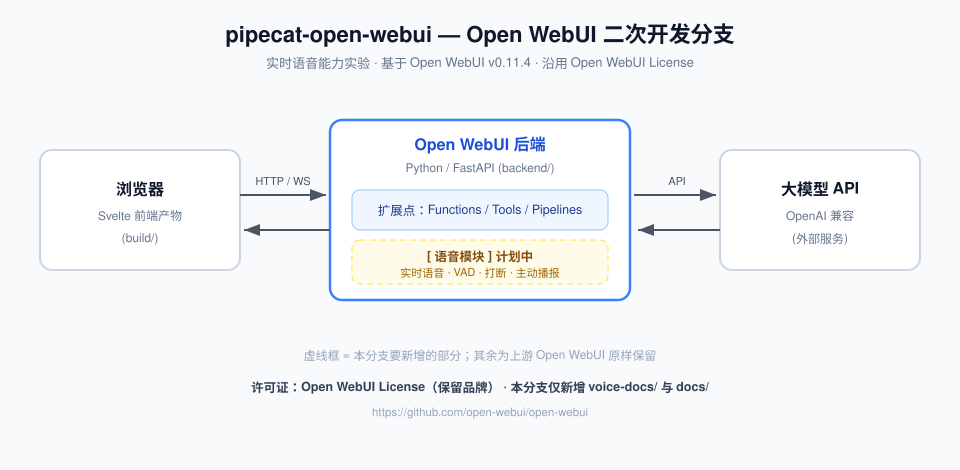

# Open WebUI 👋

> [!IMPORTANT]
> **本仓库是 [Open WebUI](https://github.com/open-webui/open-webui) 的二次开发分支（fork），代号 `pipecat-open-webui`。**
>
> - **目的**：实验「把实时语音能力作为一个零件，插入现成的 agent 系统」（测试性质，非生产）
> - **基线**：Open WebUI `v0.11.4`
> - **许可**：**双协议** —— ① 上游代码沿用 **Open WebUI License**（保留品牌，见 [`LICENSE`](./LICENSE)）；② **本分支新增的独立文件采用 MIT**（见 [`LICENSE-SUPPLEMENT.md`](./LICENSE-SUPPLEMENT.md)）
> - **本分支新增**：[`voice-docs/INTEGRATION.md`](./voice-docs/INTEGRATION.md)（**语音接入说明：改了什么 / 调了哪些接口**）、[`voice-docs/VOICE-MODES.md`](./voice-docs/VOICE-MODES.md)（**语音形态怎么选**）、[`voice-docs/VOICE-UX.md`](./voice-docs/VOICE-UX.md)（**语音交互体验怎么复现**）、[`voice-docs/`](./voice-docs)（定位 / 平台选型 / 变更记录）、[`CONTRIBUTING.md`](./CONTRIBUTING.md)、[`FAQ.md`](./FAQ.md)、[`AUTHORS`](./AUTHORS)
> - **上游项目**：<https://github.com/open-webui/open-webui> ｜ 文档：<https://docs.openwebui.com/>
> - **本分支作者 / 仓库**：cnb.lpk ｜ <https://cnb.cool/lpk3215/pipecat-voice-agents>（见 [`AUTHORS`](./AUTHORS)）
> - **同仓库的其他项目**：[`../pipecat-quickstart/`](../pipecat-quickstart/)（完整语音 Agent）、[`../voice-module-dify/`](../voice-module-dify/)（语音模块，**主动调**平台）。本项目与后者**方向相反**：这里是**被宿主系统调用**的零件。总览见 [`../README.md`](../README.md)
>
> 本分支视角的架构：

## 本分支怎么跑 🚀

> ⚠️ **本节是本分支自己的运行方式，与下方上游的 pip / Docker 安装说明不同**（这里是**源码模式**，方便改代码）。

### 前置

Node 22+ / Python 3.12 / uv。**不需要 GPU** —— Open WebUI 只做「界面 + 编排」，模型算力在你连的大模型 API 那边（纯 CPU 服务器完全够用）。

### 三步启动

```bash
cd /workspace/pipecat-open-webui

# 1) 后端依赖（用官方「瘦身版」requirements-slim.txt，跳过 chromadb / transformers / onnxruntime 等重依赖）
cd backend && uv venv .venv --python 3.12 && uv pip install --python .venv/bin/python -r requirements-slim.txt && cd ..

# 2) 前端依赖 + 构建（Node 默认堆约 4GB 不够，必须调大，否则 OOM）
NODE_OPTIONS="--max-old-space-size=10240" npm ci
NODE_OPTIONS="--max-old-space-size=10240" npm run build
```

```bash
# 3) 启动（USE_SLIM_DOCKER=true 是官方瘦身开关；PORT 必须写在 shell 环境里，写 .env 对它无效）
cd backend && USE_SLIM_DOCKER=true FRONTEND_BUILD_DIR=/workspace/pipecat-open-webui/build PORT=8000 \
  PATH="$PWD/.venv/bin:$PATH" ./start.sh
```

**停止**：`pkill -f "uvicorn open_webui"`

### 访问地址

| 场景 | 地址 |
|---|---|
| 本机 | <http://localhost:8000> |
| **CNB 云环境（当前）** | **<https://6p1cwlsz8a-8000.cnb.run>** |

> CNB 的转发规则来自环境变量 `CNB_VSCODE_PROXY_URI=https://6p1cwlsz8a-{{port}}.cnb.run`，把 `{{port}}` 换成 `8000` 即可。
> 首次访问需注册管理员账号（**第一个注册的用户即管理员**）。

### 配置（`.env`）

`.env` 会被自动加载，且已被 `.gitignore` 忽略（不会提交）：

| 变量 | 说明 |
|---|---|
| `OPENAI_API_BASE_URL` / `OPENAI_API_KEY` | 接大模型（OpenAI 兼容）；本分支当前用商汤日日新 |
| `USE_SLIM_DOCKER=true` | 跳过 chromadb 等重依赖（纯 CPU 机器建议开） |
| `WHISPER_LANGUAGE=zh` | ⚠️ **必设**！不设时 Whisper 会「自动猜语种」，实测把中文**误判成泰语** |
| `PORT=8000` | ⚠️ 必须写在 **shell 环境**里，写在 `.env` 里对 `start.sh` 无效 |

**语音相关配置与排查**见 [`FAQ.md`](./FAQ.md) Q14、[`voice-docs/VOICE-UX.md`](./voice-docs/VOICE-UX.md)。

---


[](https://discord.gg/5rJgQTnV4s)
[](https://github.com/sponsors/open-webui)

Open WebUI is **a home for AI**, a self-hosted AI platform that's **[extensible](https://docs.openwebui.com/features/extensibility/plugin/)**, **[feature-rich](https://docs.openwebui.com/features/)**, user-friendly, and built to run **[entirely offline](https://openwebui.com/sovereign-ai)**. With support for **Ollama** and **OpenAI-compatible APIs**, it gives you a powerful, provider-agnostic interface for both local and cloud-based models.

Passionate about open-source AI? [Join our team →](https://careers.openwebui.com/)

<!-- 上游演示图（本分支为精简仓库已移除 ./demo.png，可参考 https://github.com/open-webui/open-webui ） -->

> [!TIP]  
> **Looking for an [Enterprise Plan](https://docs.openwebui.com/enterprise)?** – **[Speak with Our Sales Team Today!](https://docs.openwebui.com/enterprise)**

For more information, be sure to check out our [Open WebUI Documentation](https://docs.openwebui.com/).

## Key Features of Open WebUI ⭐

- 🚀 **Effortless Setup**: Install seamlessly via pip, uv, Docker, or Kubernetes (kubectl, kustomize, or helm), with `:ollama` and `:cuda` tagged images available for container deployments.

- 🤝 **Broad Model & API Integration**: Connect any OpenAI-compatible API alongside local Ollama models. Point the API URL at **LMStudio, GroqCloud, Mistral, OpenRouter, vLLM, and more** to mix and match providers freely.

- 🔐 **Granular RBAC & User Groups**: Administrators define detailed roles, groups, and permissions, giving each user exactly the access they need. Secure by default, with tailored experiences per group.

- 🧩 **Plugin Support**: Extend Open WebUI with **Filters**, **Actions**, **Pipes**, **Tools**, and **Skills**. Connect external services through **MCP**, **MCPO**, and **OpenAPI tool servers**. Build custom integrations, rate limits, approval flows, data connections, and more.

- 🤖 **Models & Agents**: Wrap any base model with custom instructions, tools, and knowledge to build specialized agents. Supports dynamic variables, per-user/group access control, and community preset imports via [Open WebUI Community](https://openwebui.com/).

- ⚡ **Agentic Execution with [Open Terminal](https://github.com/open-webui/open-terminal)**: Give your agents a terminal and filesystem to carry out multi-step tasks. Let them analyze data, run scripts, fix errors, and produce files directly in chat. Scale to teams with **[Terminals (Enterprise)](https://github.com/open-webui/terminals)** for per-user isolated environments, resource limits, and automatic lifecycle management.

- 📝 **Notes**: A dedicated workspace for content outside conversations. Draft with a rich editor, use AI to rewrite selected text, and attach notes to any chat for full-context injection.

- 📢 **Channels**: Real-time shared spaces where your team and AI models collaborate in one timeline. Tag models to draft or critique, with threads, reactions, pins, and access control.

- 🧠 **Persistent Memory**: The AI remembers facts about you across conversations, carrying context from one chat to the next.

- ✅ **Live Workflow & Message Flow**: Watch the AI build and work through checklists in real time. Queue messages while the AI is still responding; they send automatically when it's ready.

- 📅 **Calendar & AI Scheduling**: Built-in personal and shared calendars with month/week/day views, recurring events, color coding, attendees, and reminders. Models manage your schedule conversationally through native function calling.

- ⏱️ **Automations**: Schedule prompts to run on recurring schedules, with runs surfaced on your calendar and each completed run linking back to the chat it produced.

- 📱 **Responsive Design & PWA**: Seamless experience across desktop, laptop, and mobile, with a Progressive Web App for native app-like feel and offline access on localhost.

- ✒️🔢 **Full Markdown and LaTeX Support**: Comprehensive Markdown and LaTeX capabilities for enriched interaction.

- 🎤📹 **Hands-Free Voice/Video Call**: Integrated voice and video calls with multiple Speech-to-Text providers (Local Whisper, OpenAI, Deepgram, Azure) and Text-to-Speech engines (Azure, ElevenLabs, OpenAI, Transformers, WebAPI).

- 💾 **Persistent Artifact Storage**: Built-in key-value storage API for artifacts, enabling journals, trackers, leaderboards, and collaborative tools with personal and shared data scopes.

- 📚 **Local RAG Integration**: Retrieval Augmented Generation backed by 9 vector databases and multiple content-extraction engines (Tika, Docling, Document Intelligence, Mistral OCR, PaddleOCR-vl, external loaders). Supports hybrid search (BM25 + vector) with reranking and full-context mode. Load documents into chat or pull them from your library with the `#` command.

- 🔍 **Web Search for RAG**: Search the web through dozens of providers including `SearXNG`, `Google PSE`, `Brave Search`, `Kagi`, `Mojeek`, `Tavily`, `Perplexity`, `Firecrawl`, `serpstack`, `serper`, `Serply`, `DuckDuckGo`, `SearchApi`, `SerpApi`, `Bing`, `Jina`, `Exa`, `Sougou`, `Azure AI Search`, and `Ollama Cloud`, injecting results directly into the conversation.

- 🌐 **Web Browsing Capability**: Pull websites into chat with the `#` command followed by a URL, or let the model fetch them on its own when needed.

- 🎨 **Image Generation & Editing**: Create and edit images with multiple engines including OpenAI DALL·E, Gemini, ComfyUI (local), and AUTOMATIC1111 (local), supporting both generation and prompt-based editing.

- ⚙️ **Multi-Model Conversations**: Engage several models at once, harnessing their individual strengths in parallel for the best possible responses.

- 📊 **Usage Analytics & Model Evaluation**: Admin dashboards track message volume, token consumption, and cost across users and models. Evaluate models with a built-in arena, A/B testing, and ELO-based leaderboards.

- 🗄️ **Flexible Database & Storage**: Choose SQLite (with optional encryption) or PostgreSQL, and store files locally or on S3, Google Cloud Storage, or Azure Blob Storage.

- 🧬 **Advanced Vector Database Support**: Pick from 9 vector databases: ChromaDB, PGVector, Qdrant, Milvus, Elasticsearch, OpenSearch, Pinecone, S3Vector, and Oracle 23ai.

- 🪪 **Enterprise Authentication & Provisioning**: Full LDAP/Active Directory integration, SSO via trusted headers and OAuth providers, and SCIM 2.0 automated provisioning for identity providers like Okta, Azure AD, and Google Workspace.

- ☁️ **Cloud-Native File Integration**: Native Google Drive and OneDrive/SharePoint file picking for seamless document import from enterprise cloud storage.

- 🔭 **Production Observability**: Built-in OpenTelemetry support for traces, metrics, and logs, plugging into your existing monitoring stack.

- ⚖️ **Horizontal Scalability**: Redis-backed session management and WebSocket support for multi-worker, multi-node deployments behind load balancers.

- 🌐🌍 **Multilingual Support**: Use Open WebUI in your preferred language with i18n support. We're actively seeking contributors to expand language coverage!

- 🌟 **Continuous Updates**: We're committed to improving Open WebUI with regular updates, fixes, and new features.

- 🛡️ **Transparent Security Process**: Security reports are triaged, fixed, and published as open advisories through a documented responsible-disclosure process. See our [Security Policy](https://github.com/open-webui/open-webui/security).

Want to learn more about Open WebUI's features? Check out our [Open WebUI documentation](https://docs.openwebui.com/features) for a comprehensive overview!

## The Open WebUI Ecosystem 🌐

Open WebUI is the core, surrounded by companion apps and infrastructure that extend what your AI can do, where it can reach, and how you run it:

- 💻 **Open WebUI Computer** ([open-webui/computer](https://github.com/open-webui/computer)): A standalone, mobile-first computer and coding agent that runs on the machine you own. Files, terminal, and git in a browser tab, reachable from your phone. Connect it into Open WebUI as a model, or reach it from Telegram, WhatsApp, and more.

- ⚡ **Open Terminal** and **Terminals (Enterprise)** ([open-webui/open-terminal](https://github.com/open-webui/open-terminal) & [open-webui/terminals](https://github.com/open-webui/terminals)): A self-hosted computing environment that plugs into Open WebUI, giving the AI a place to write code, run it, read output, fix errors, and iterate inside the chat. Terminals gives you per-user isolated containers with separate credentials, resource limits, and network rules. Automatic lifecycle management on Docker or Kubernetes.

- 🔄 **oikb** ([open-webui/oikb](https://github.com/open-webui/oikb)): Feed your Knowledge Bases from 45+ sources (GitHub, Confluence, ServiceNow, Salesforce, Jira, Slack, SharePoint, Notion, and more), keeping the tools your team already uses continuously in sync.

- 🖥️ **Native Desktop App** ([open-webui/desktop](https://github.com/open-webui/desktop)): Run Open WebUI as a native app on macOS, Windows, and Linux. System-wide Spotlight chat bar with screenshot capture, push-to-talk voice, and optional fully-local inference via a built-in llama.cpp engine.

Want to learn more? Check out our [Open WebUI documentation](https://docs.openwebui.com) for more details!

---

We are incredibly grateful for the generous support of our sponsors. Their contributions help us to maintain and improve our project, ensuring we can continue to deliver quality work to our community. Thank you!

## How to Install 🚀

### Installation via Python pip 🐍

Open WebUI can be installed using pip, the Python package installer. Before proceeding, ensure you're using **Python 3.11** to avoid compatibility issues.

1. **Install Open WebUI**:
   Open your terminal and run the following command to install Open WebUI:

   ```bash
   pip install open-webui
   ```

2. **Running Open WebUI**:
   After installation, you can start Open WebUI by executing:

   ```bash
   open-webui serve
   ```

This will start the Open WebUI server, which you can access at [http://localhost:8080](http://localhost:8080)

### Quick Start with Docker 🐳

> [!NOTE]  
> Please note that for certain Docker environments, additional configurations might be needed. If you encounter any connection issues, our detailed guide on [Open WebUI Documentation](https://docs.openwebui.com/) is ready to assist you.

> [!WARNING]
> When using Docker to install Open WebUI, make sure to include the `-v open-webui:/app/backend/data` in your Docker command. This step is crucial as it ensures your database is properly mounted and prevents any loss of data.

> [!TIP]  
> If you wish to utilize Open WebUI with Ollama included or CUDA acceleration, we recommend utilizing our official images tagged with either `:cuda` or `:ollama`. To enable CUDA, you must install the [Nvidia CUDA container toolkit](https://docs.nvidia.com/dgx/nvidia-container-runtime-upgrade/) on your Linux/WSL system.

### Installation with Default Configuration

- **If Ollama is on your computer**, use this command:

  ```bash
  docker run -d -p 3000:8080 --add-host=host.docker.internal:host-gateway -v open-webui:/app/backend/data --name open-webui --restart always ghcr.io/open-webui/open-webui:main
  ```

- **If Ollama is on a Different Server**, use this command:

  To connect to Ollama on another server, change the `OLLAMA_BASE_URL` to the server's URL:

  ```bash
  docker run -d -p 3000:8080 -e OLLAMA_BASE_URL=https://example.com -v open-webui:/app/backend/data --name open-webui --restart always ghcr.io/open-webui/open-webui:main
  ```

- **To run Open WebUI with Nvidia GPU support**, use this command:

  ```bash
  docker run -d -p 3000:8080 --gpus all --add-host=host.docker.internal:host-gateway -v open-webui:/app/backend/data --name open-webui --restart always ghcr.io/open-webui/open-webui:cuda
  ```

### Installation for OpenAI API Usage Only

- **If you're only using OpenAI API**, use this command:

  ```bash
  docker run -d -p 3000:8080 -e OPENAI_API_KEY=your_secret_key -v open-webui:/app/backend/data --name open-webui --restart always ghcr.io/open-webui/open-webui:main
  ```

### Installing Open WebUI with Bundled Ollama Support

This installation method uses a single container image that bundles Open WebUI with Ollama, allowing for a streamlined setup via a single command. Choose the appropriate command based on your hardware setup:

- **With GPU Support**:
  Utilize GPU resources by running the following command:

  ```bash
  docker run -d -p 3000:8080 --gpus=all -v ollama:/root/.ollama -v open-webui:/app/backend/data --name open-webui --restart always ghcr.io/open-webui/open-webui:ollama
  ```

- **For CPU Only**:
  If you're not using a GPU, use this command instead:

  ```bash
  docker run -d -p 3000:8080 -v ollama:/root/.ollama -v open-webui:/app/backend/data --name open-webui --restart always ghcr.io/open-webui/open-webui:ollama
  ```

Both commands facilitate a built-in, hassle-free installation of both Open WebUI and Ollama, ensuring that you can get everything up and running swiftly.

After installation, you can access Open WebUI at [http://localhost:3000](http://localhost:3000). Enjoy! 😄

### Other Installation Methods

We offer various installation alternatives, including non-Docker native installation methods, Docker Compose, Kustomize, and Helm. Visit our [Open WebUI Documentation](https://docs.openwebui.com/getting-started/) or join our [Discord community](https://discord.gg/5rJgQTnV4s) for comprehensive guidance.

### Troubleshooting

Encountering connection issues? Our [Open WebUI Documentation](https://docs.openwebui.com/troubleshooting/) has got you covered. For further assistance and to join our vibrant community, visit the [Open WebUI Discord](https://discord.gg/5rJgQTnV4s).

#### Open WebUI: Server Connection Error

If you're experiencing connection issues, it’s often due to the WebUI docker container not being able to reach the Ollama server at 127.0.0.1:11434 (host.docker.internal:11434) inside the container . Use the `--network=host` flag in your docker command to resolve this. Note that the port changes from 3000 to 8080, resulting in the link: `http://localhost:8080`.

**Example Docker Command**:

```bash
docker run -d --network=host -v open-webui:/app/backend/data -e OLLAMA_BASE_URL=http://127.0.0.1:11434 --name open-webui --restart always ghcr.io/open-webui/open-webui:main
```

### Keeping Your Docker Installation Up-to-Date

Check our Updating Guide available in our [Open WebUI Documentation](https://docs.openwebui.com/getting-started/updating).

### Using the Dev Branch 🌙

> [!WARNING]
> The `:dev` branch contains the latest unstable features and changes. Use it at your own risk as it may have bugs or incomplete features.

If you want to try out the latest bleeding-edge features and are okay with occasional instability, you can use the `:dev` tag like this:

```bash
docker run -d -p 3000:8080 -v open-webui:/app/backend/data --name open-webui --add-host=host.docker.internal:host-gateway --restart always ghcr.io/open-webui/open-webui:dev
```

### Offline Mode

If you are running Open WebUI in an offline environment, you can set the `HF_HUB_OFFLINE` environment variable to `1` to prevent attempts to download models from the internet.

```bash
export HF_HUB_OFFLINE=1
```

## What's Next? 🌟

Discover upcoming features on our roadmap in the [Open WebUI Documentation](https://docs.openwebui.com/roadmap/).

## License 📜

This project contains code under multiple licenses. The current codebase includes components licensed under the Open WebUI License with an additional requirement to preserve the "Open WebUI" branding, as well as prior contributions under their respective original licenses. For a detailed record of license changes and the applicable terms for each section of the code, please refer to [LICENSE_HISTORY](./LICENSE_HISTORY). For complete and updated licensing details, please see the [LICENSE](./LICENSE) and [LICENSE_HISTORY](./LICENSE_HISTORY) files.

## Support 💬

If you have any questions, suggestions, or need assistance, please open an issue or join our
[Open WebUI Discord community](https://discord.gg/5rJgQTnV4s) to connect with us! 🤝

## Security 🛡️

If you believe you've found a security vulnerability, or something that shouldn't be disclosed publicly, please [reach out confidentially through our responsible disclosure program on GitHub](https://github.com/open-webui/open-webui/security). We accept reports only through GitHub, not through any other platform. Thank you for helping us keep Open WebUI secure!

## Star History

<a href="https://star-history.com/#open-webui/open-webui&Date">
  <picture>
    <source media="(prefers-color-scheme: dark)" srcset="https://api.star-history.com/svg?repos=open-webui/open-webui&type=Date&theme=dark" />
    <source media="(prefers-color-scheme: light)" srcset="https://api.star-history.com/svg?repos=open-webui/open-webui&type=Date" />
    
  </picture>
</a>

---

Created by [Timothy Jaeryang Baek](https://github.com/tjbck) - Let's make Open WebUI even more amazing together! 💪
